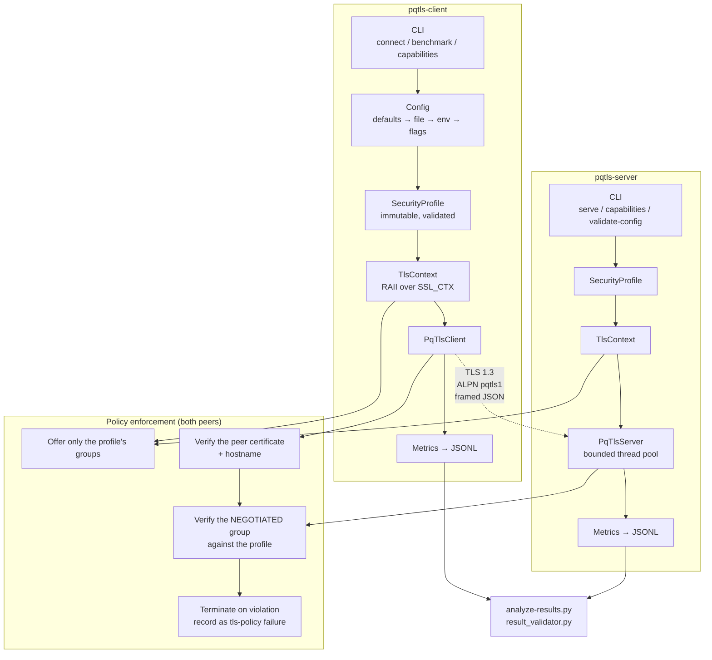
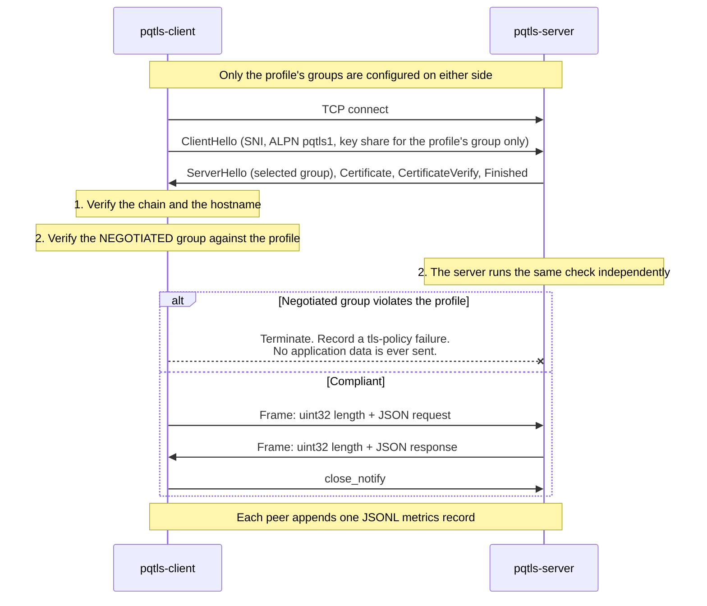

# pqtls-lab

**A crypto-agile TLS 1.3 client and server for measuring the real cost of hybrid post-quantum key establishment.**

[](https://github.com/N-Bermparis/pqtls-lab/actions/workflows/build.yml)
[](https://github.com/N-Bermparis/pqtls-lab/actions/workflows/tests.yml)
[](https://github.com/N-Bermparis/pqtls-lab/actions/workflows/security.yml)
[](https://github.com/N-Bermparis/pqtls-lab/actions/workflows/docker.yml)
[](LICENSE)
[](https://en.cppreference.com/w/cpp/20)

---

> ## ⚠️ Security status
>
> **This is a research prototype. It is not production software and must not be
> deployed to protect anything real.**
>
> * It **has not been independently audited.**
> * The hybrid profiles provide post-quantum **key establishment**. Server
>   authentication uses a **classical ECDSA signature**. Such a connection is
>   protected against *harvest-now-decrypt-later*, but it is **not**
>   end-to-end quantum-safe.
> * Post-quantum **authentication** (ML-DSA) exists only as a clearly separated,
>   capability-gated experiment.
> * Behaviour depends on the exact OpenSSL build. Group names and availability
>   have changed between releases and may change again.
> * The hybrid TLS group definitions are **in-progress standards work**, not
>   finalised RFCs. See [`docs/pqc-standards-status.md`](docs/pqc-standards-status.md).

---

## Contents

- [Motivation](#motivation)
- [Research questions](#research-questions)
- [Features](#features)
- [Architecture](#architecture)
- [Key establishment is not authentication](#key-establishment-is-not-authentication)
- [Security profiles](#security-profiles)
- [Requirements](#requirements)
- [Quick start](#quick-start)
- [Benchmarking](#benchmarking)
- [Network experiments](#network-experiments)
- [Results format](#results-format)
- [Limitations](#limitations)
- [Standards status](#standards-status)
- [Roadmap](#roadmap)
- [Citation](#citation)
- [Contributing](#contributing)
- [Licence](#licence)
- [Contact](#contact)

---

## Motivation

An adversary who records encrypted traffic today can decrypt it later, once a
cryptographically relevant quantum computer exists. Every TLS connection whose
confidentiality must outlive that event is already at risk — the attack does not
wait for the machine to be built. This is the *harvest-now-decrypt-later*
problem, and it is why key establishment is being migrated first, ahead of
authentication: a forged signature must be produced *during* a handshake, while
a recorded key exchange can be attacked at leisure.

Migration is not free. ML-KEM key shares are far larger than an elliptic-curve
public key, which enlarges the ClientHello, which interacts badly with small
path MTUs, packet loss and constrained devices. The interesting questions are
not whether hybrid TLS works — it does — but what it costs, where it breaks, and
whether an application can switch profiles without silently ending up on a
weaker one.

**pqtls-lab exists to measure that, honestly.** It is built so that a result is
either measured or explicitly absent; there are no placeholder numbers anywhere
in this repository.

## Research questions

| | Question |
|---|---|
| **RQ1** | **Performance.** What latency, CPU, memory and bandwidth overhead does hybrid post-quantum TLS introduce compared with classical TLS 1.3? |
| **RQ2** | **Network reliability.** How do latency, packet loss, bandwidth limits and MTU size affect hybrid post-quantum TLS handshakes? |
| **RQ3** | **Edge-device feasibility.** Can hybrid post-quantum TLS operate efficiently on constrained devices such as Raspberry Pi systems? |
| **RQ4** | **Crypto-agility.** Can applications switch between explicitly defined TLS security profiles without introducing silent downgrade behaviour? |
| **RQ5** | **Authentication.** What additional overhead is introduced when post-quantum authentication is used instead of conventional ECDSA authentication? |
| **RQ6** | **Connection management.** How much can persistent connections and session resumption reduce the relative cost of post-quantum handshakes? |

## Features

- **TLS 1.3 only.** TLS 1.2 and earlier are disabled at both the version bounds
  and the option flags.
- **Explicit security profiles.** A profile names its groups, its cipher suites
  and its authentication type. Only those groups are offered — there is nothing
  else for a peer to steer the connection towards.
- **Post-handshake downgrade rejection.** Configuring the group list constrains
  what we *offer*; the negotiated group is then verified against the profile on
  **both** peers, and a connection that violates policy is terminated before any
  application data flows.
- **Honest capability detection.** `capabilities` probes the running OpenSSL with
  the same calls a real connection makes. A profile is reported usable only when
  it has been proven usable, and an unavailable one always states why.
- **Framed application protocol.** A 4-byte length prefix and a validated JSON
  payload, with limits on size, UTF-8 validity, nesting depth and message type.
- **Machine-readable results.** One JSON Lines record per connection, with a
  published schema and a validator that rejects records making claims their
  negotiated group does not support.
- **Reproducibility.** Pinned OpenSSL with a verified checksum, pinned
  dependencies, pinned base-image digests, and system metadata recorded with
  every experiment.
- **Mutual TLS**, and **experimental ML-DSA authentication** behind a capability
  gate.

## Architecture



Connection lifecycle, and where policy is enforced:



More detail: [`docs/architecture.md`](docs/architecture.md),
[`docs/protocol.md`](docs/protocol.md).

## Key establishment is not authentication

This distinction is the one thing to take away from this project, and it is
enforced in the code, the metrics schema, the validator and CI.

A TLS connection has three separable cryptographic properties:

| Property | What it does | Broken by a quantum computer? | Post-quantum answer |
|---|---|---|---|
| **Key establishment** | Agrees the session keys | **Yes** — and retroactively, against traffic recorded today | ML-KEM, usually in a hybrid with ECDH |
| **Authentication** | Proves who the peer is | **Yes** — but only *during* a live handshake | ML-DSA (experimental here) |
| **Record protection** | Encrypts the data | No — symmetric ciphers are only weakened, and AES-256 remains adequate | Unchanged; AES-256-GCM or ChaCha20-Poly1305 |

Key establishment is migrated first because it is the only one of the three that
is attackable *retroactively*. A signature forged in 2035 cannot help an attacker
impersonate a server in a handshake that happened in 2026; a key exchange
recorded in 2026 can be broken in 2035 and the traffic read.

So when `pqtls-lab` reports:

```
PQ key establishment : yes (hybrid)
PQ authentication    : no
```

that is the accurate description of the primary profile: **the session keys
resist a future quantum adversary; the server's identity does not.** Every
metrics record carries these as three separate booleans
(`pq_key_establishment`, `hybrid_key_establishment`, `pq_authentication`)
precisely so they cannot be collapsed into a single misleading claim.

## Security profiles

| Profile | TLS group | Key establishment | Authentication | Status |
|---|---|---|---|---|
| `classical-x25519` | `X25519` | Classical | ECDSA P-256 | Stable baseline |
| `classical-p256` | `secp256r1` | Classical | ECDSA P-256 | Stable baseline |
| `hybrid-x25519-mlkem768` | `X25519MLKEM768` | **Hybrid PQ** | ECDSA P-256 | **Primary** |
| `hybrid-p256-mlkem768` | `SecP256r1MLKEM768` | **Hybrid PQ** | ECDSA P-256 | Secondary |
| `hybrid-p384-mlkem1024` | `SecP384r1MLKEM1024` | **Hybrid PQ** | ECDSA P-384 | High-security experiment |
| `hybrid-x25519-mlkem768-mtls` | `X25519MLKEM768` | **Hybrid PQ** | ECDSA P-256, mutual | Stable |
| `pure-mlkem768` | `MLKEM768` | **Pure PQ**, no classical component | ECDSA P-256 | ⚗️ Experimental, off by default |
| `hybrid-pq-auth` | `X25519MLKEM768` | **Hybrid PQ** | **ML-DSA-65** | ⚗️ Experimental, capability-gated |

`hybrid-pq-auth` is the only profile in which *both* key establishment and
authentication are post-quantum. It requires ML-DSA support in the runtime
OpenSSL and certificates from a private CA that nothing outside this project
will accept.

**No profile exists on every system.** Always check first:

```bash
pqtls-client capabilities
```

## Requirements

| | Minimum | Notes |
|---|---|---|
| C++ compiler | GCC 11+ or Clang 14+ | C++20 |
| CMake | 3.22 | |
| OpenSSL | 3.0 to build, **3.5+ for post-quantum profiles** | Below 3.5 the classical baseline works and every PQ profile reports itself unavailable |
| Python | 3.9+ | Benchmark orchestration and analysis |
| OS | Ubuntu 22.04+, Debian 12+, WSL2, Raspberry Pi OS 64-bit | `tc netem` experiments need Linux |

Pinned dependencies: `nlohmann/json` 3.11.3 (MIT), `yaml-cpp` 0.8.0 (MIT),
`spdlog` 1.14.1 (MIT), `Catch2` 3.5.2 (BSL-1.0). All pinned by commit; see
[`docs/build-guide.md`](docs/build-guide.md).

## Quick start

### Ubuntu / WSL

```bash
git clone https://github.com/N-Bermparis/pqtls-lab.git
cd pqtls-lab
```

The bootstrap script installs the toolchain and, **only if the system OpenSSL is
older than 3.5**, builds a pinned OpenSSL into `/opt`. It never replaces the
system OpenSSL:

```bash
scripts/bootstrap-ubuntu.sh
```

Check what the host can actually do before going further:

```bash
scripts/verify-environment.sh
```

Generate the development PKI (ECDSA P-256, SANs for `localhost`, `127.0.0.1`,
`::1`; the keys are git-ignored and never leave your machine):

```bash
scripts/generate-classical-certs.sh --with-client
```

Build:

```bash
scripts/build.sh --test
```

If the bootstrap installed a pinned OpenSSL, point the build at it:

```bash
scripts/build.sh --openssl-root /opt/openssl-3.5.7 --test
```

### Confirm what this build supports

```bash
./build/relwithdebinfo/pqtls-client capabilities
```

This reports the compile-time and runtime OpenSSL versions, the loaded
providers, the TLS groups that were *proven* to work, the signature algorithms,
whether ML-KEM and ML-DSA are available **separately**, and whether each profile
is usable — with a reason whenever one is not.

### First server

```bash
./build/relwithdebinfo/pqtls-server serve \
  --listen 127.0.0.1 \
  --port 8443 \
  --profile hybrid-x25519-mlkem768 \
  --certificate certs/classical/server.crt \
  --private-key certs/classical/server.key \
  --metrics experiments/results/server.jsonl
```

### First client

```bash
./build/relwithdebinfo/pqtls-client connect \
  --host 127.0.0.1 \
  --port 8443 \
  --server-name localhost \
  --profile hybrid-x25519-mlkem768 \
  --ca-certificate certs/classical/ca.crt \
  --message '{"type":"ping"}' \
  --metrics experiments/results/client.jsonl
```

Expected shape of the output (**the timings shown are `<measured>` placeholders —
this repository contains no invented numbers**):

```text
connection succeeded
  peer              : 127.0.0.1:8443
  requested profile : hybrid-x25519-mlkem768
  TLS version       : TLSv1.3
  negotiated group  : X25519MLKEM768
  cipher suite      : TLS_AES_256_GCM_SHA384
  authentication    : ecdsa_secp256r1_sha256
  session reused    : no
  handshake         : <measured> ms
  connection        : <measured> ms
  bytes sent/recv   : 164 / 141
  PQ key establishment : yes (hybrid)
  PQ authentication    : no
  note: the key exchange is post-quantum but the server authenticated with a
        classical signature. This connection is not end-to-end quantum-safe.
  response          : {"protocol_version":1,"message_id":"...","type":"pong",...}
```

### Docker

```bash
scripts/generate-classical-certs.sh --with-client
cd docker
docker compose up --build
```

The image builds a checksum-verified OpenSSL 3.5.7, **fails the build** if the
hybrid groups are absent, runs the unit tests, and ships a non-root runtime
image containing no key material.

### Seeing downgrade rejection work

Start a classical server, then point a hybrid client at it:

```bash
./build/relwithdebinfo/pqtls-server serve --port 8443 --profile classical-x25519 \
  --certificate certs/classical/server.crt --private-key certs/classical/server.key &

./build/relwithdebinfo/pqtls-client connect --host 127.0.0.1 --port 8443 \
  --server-name localhost --profile hybrid-x25519-mlkem768 \
  --ca-certificate certs/classical/ca.crt
```

The connection **fails**, with a non-zero exit code, rather than quietly
completing over X25519. That failure is the feature.

## Benchmarking

```bash
python3 scripts/run-benchmarks.py \
  --profiles classical-x25519 hybrid-x25519-mlkem768 \
  --connections 100 \
  --concurrency 1 10 50 \
  --payloads 100 1024
```

The runner verifies capabilities first, records a system-metadata manifest
before starting, runs a discarded warm-up phase, preserves every raw
measurement including failures, and writes the manifest after each cell so an
interrupted run keeps what it has.

Summarise:

```bash
python3 scripts/analyze-results.py experiments/results --csv summary.csv
```

Statistics reported: count, success and failure rate, mean, median, min, max,
standard deviation, p50/p90/p95/p99, and a 95% confidence interval using
Student's *t*. A statistic that cannot be computed from the samples available is
reported as `null` — never as `0`.

Validate before drawing conclusions:

```bash
python3 tools/result_validator.py experiments/results/*.jsonl
```

The validator rejects any record claiming post-quantum protection that its
negotiated group does not provide.

The documentation is checked the same way, because a false claim about a
security property is itself a defect:

```bash
python3 scripts/check-claims.py
```

## Network experiments

Requires Linux with `NET_ADMIN`. **These scripts change kernel networking.**
They demand an explicit `--interface`, warn before touching the default route,
support `--dry-run`, save the previous state, and provide a reliable reset.

```bash
sudo scripts/apply-netem.sh --interface lo --delay 50ms --jitter 5ms
sudo scripts/apply-netem.sh --interface lo --loss 1%
sudo scripts/apply-netem.sh --interface lo --mtu 1280
sudo scripts/reset-netem.sh --interface lo
```

Capture and analyse the handshake:

```bash
sudo scripts/capture-packets.sh --interface lo --port 8443 --output captures/hybrid.pcap
python3 tools/pcap_metrics.py captures/hybrid.pcap
```

Definitions for the latency, packet-loss, MTU, concurrency and Raspberry Pi
sweeps are in [`experiments/definitions/`](experiments/definitions/).

## Results format

One JSON Lines record per connection, validated against
[`schemas/metrics.schema.json`](schemas/metrics.schema.json):

```json
{
  "schema_version": 1,
  "experiment_id": "baseline-2026-001",
  "connection_id": "3f2a1b4c-5d6e-4f70-8901-a2b3c4d5e6f7",
  "role": "client",
  "requested_profile": "hybrid-x25519-mlkem768",
  "negotiated_group": "X25519MLKEM768",
  "tls_version": "TLSv1.3",
  "cipher_suite": "TLS_AES_256_GCM_SHA384",
  "authentication": "ecdsa_secp256r1_sha256",
  "handshake_ms": null,
  "connection_ms": null,
  "application_bytes_sent": 164,
  "application_bytes_received": 141,
  "session_reused": false,
  "success": true,
  "error_category": null,
  "pq_key_establishment": true,
  "hybrid_key_establishment": true,
  "pq_authentication": false,
  "timestamp": "2026-08-05T10:00:00.000Z"
}
```

The timings are `null` here because **this is a format example, not a
measurement.** A real record carries real numbers.

## Limitations

Read [`docs/limitations.md`](docs/limitations.md) in full before citing anything
from this project. In brief:

- **Research prototype, not audited.** No independent security review has been
  performed.
- **PQ key establishment only** in the non-experimental profiles. Authentication
  stays classical.
- **Behaviour is tied to the OpenSSL build.** Group names and availability have
  changed between releases.
- **The hybrid group definitions are draft standards work**, not finalised RFCs.
- **Pure ML-KEM profiles are experimental** and not covered by a finalised TLS
  specification.
- **ML-DSA certificates chain to a private CA** and are accepted by nothing else.
- **No benchmark results are published yet.** Every experiment definition says
  `Results not yet measured` until it has actually been run on identified
  hardware.
- **Loopback network emulation is not a real link.** MTU and loss results are
  indicative and need validation on physical hardware.

## Standards status

ML-KEM is standardised as **NIST FIPS 203**. That is the *primitive*.

How ML-KEM is carried inside TLS 1.3 — the hybrid group code points, their
names, the key-share encoding — is separate, in-progress specification work, and
`X25519MLKEM768` should be described as such rather than as an RFC. Standalone
ML-KEM groups are more experimental still.

[`docs/pqc-standards-status.md`](docs/pqc-standards-status.md) records the
current position and **the date it was last reviewed**. Check that date before
relying on it; this area moves.

## Roadmap

| Milestone | Scope | Status |
|---|---|---|
| **M0** Foundation | Structure, CMake, formatting, logging, config, CI, docs skeleton | ✅ |
| **M1** Classical baseline | TLS 1.3 client and server, ECDSA certs, verification, framed protocol, tests | ✅ |
| **M2** Hybrid PQ-TLS | Capability detection, `X25519MLKEM768`, explicit group policy, negotiated-group verification, downgrade rejection | ✅ |
| **M3** Measurement | JSONL metrics, benchmark runner, summary analysis, system metadata | ✅ implemented, ⏳ **not yet run** |
| **M4** Network experiments | netem scripts, MTU / loss / latency sweeps, PCAP analysis | ✅ tooling, ⏳ **not yet run** |
| **M5** Advanced authentication | mTLS, ML-DSA evaluation, PQ certificates, size analysis | ✅ implemented, ⏳ partially evaluated |
| **M6** Research release | Raspberry Pi evaluation, plots, technical report, reproducibility package, `v1.0.0-research` | ⏳ |

"Implemented" means the code exists and its tests pass. "Not yet run" means no
measurement has been taken, and therefore no result is claimed.

## Citation

**pqtls-lab was originally designed and developed by Nikolaos Bermparis.**

If you use pqtls-lab in academic research, a publication, thesis, technical
report, benchmark, funded research project, cybersecurity or cryptographic
evaluation, commercial proof of concept, or derivative research tool, please
cite the project.

The preferred citation metadata is provided in
[`CITATION.cff`](CITATION.cff). GitHub renders a ready-made citation from that
file under **Cite this repository**.

Suggested citation:

> Nikolaos Bermparis, *pqtls-lab: a crypto-agile TLS 1.3 research prototype
> for measuring hybrid post-quantum key establishment*, version 0.2.0, 2026.

Please cite the released version you actually used, and state the OpenSSL
version and hardware alongside any measurements or figures derived from the
project.

If pqtls-lab materially contributes to published research, a funded project,
commercial evaluation, benchmark, or substantial derivative work, appropriate
acknowledgement of the project and its original author is appreciated.

The author would also appreciate being notified when pqtls-lab is used in
published research, funded projects, commercial evaluations, or substantial
derivative work. Notification is appreciated but is not a condition of the
Apache License 2.0.
## Contributing

See [`CONTRIBUTING.md`](CONTRIBUTING.md). Contributions are welcome, especially
measurements on hardware the maintainer does not have.

Two rules matter more than the rest:

1. **Never commit a number you did not measure.** An absent result is fine; a
   plausible-looking invented one is not.
2. **Never describe post-quantum key establishment as post-quantum
   authentication.** They are different properties with different threat models.

Security vulnerabilities: **do not open a public issue.** See
[`SECURITY.md`](SECURITY.md).

## Licence

Copyright © 2026 **Nikolaos Bermparis**.

Licensed under the [Apache License 2.0](LICENSE). See [`NOTICE`](NOTICE) for
project attribution information.

Redistributions and derivative works must preserve applicable copyright,
license, and attribution notices as required by the Apache License 2.0.

Development certificates generated by the scripts in this repository are
unencrypted test material, are git-ignored, and must never be deployed.
## Contact

- **Issues and discussion:** <https://github.com/N-Bermparis/pqtls-lab/issues>
- **Security reports:** see [`SECURITY.md`](SECURITY.md)
- **Maintainer:** [Nikolaos Bermparis](https://github.com/N-Bermparis)
- **Related work:** PQAudit, a post-quantum readiness assessment platform. The
  integration boundary is a documented adapter format, not a coupling; see
  [`docs/pqaudit-integration.md`](docs/pqaudit-integration.md).
