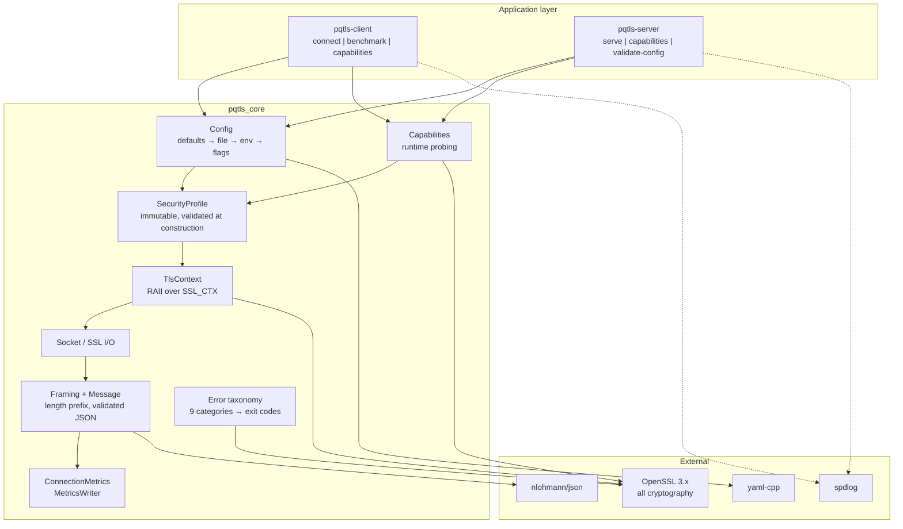
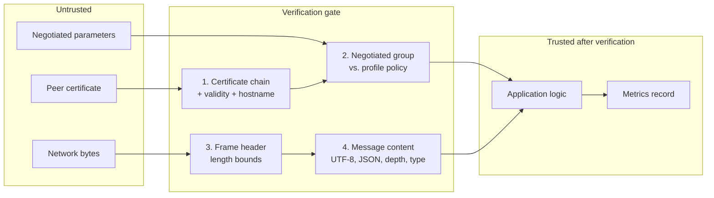
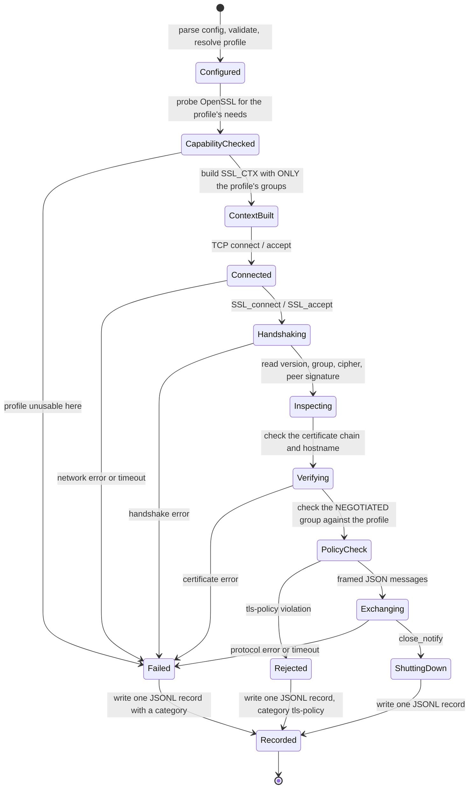
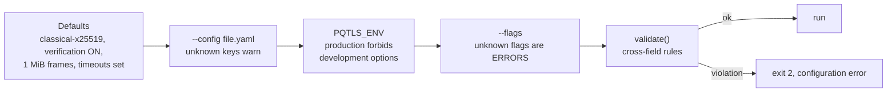
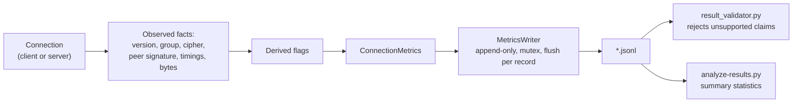
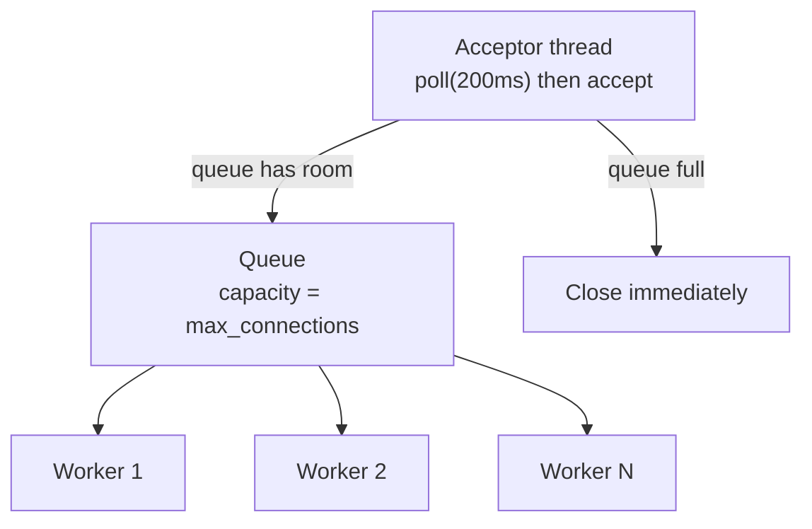

# Architecture

## Component overview



Dependencies point inwards. `SecurityProfile` knows nothing about sockets;
`TlsContext` knows nothing about the application protocol. This keeps the policy
layer testable without a network.

## Trust boundaries



The ordering of the first two checks matters. **Certificate verification comes
first**: an unauthenticated peer's claims about the negotiated group are not
worth checking, because there is no one to hold to the claim. Only once identity
is established does the group policy check mean anything.

Checks 3 and 4 run per message, for the whole life of the connection.

## Connection lifecycle



Every terminal path produces a metrics record. A failure is data, not an
absence of data — a benchmark that only recorded its successes would overstate
reliability.

## Configuration flow

Precedence, lowest to highest:

```
built-in defaults  →  YAML file  →  environment  →  command line
```



Two asymmetries are deliberate:

- **Unknown YAML keys warn; unknown command-line flags are hard errors.** A
  config file benefits from forward compatibility. A mistyped `--profiel` on the
  command line would silently leave the *default* profile in effect, which is
  exactly the silent downgrade this project exists to prevent.
- **Unknown keys in a *profile* definition are hard errors**, unlike the runtime
  config, because a profile is a security policy.

`PQTLS_ENV=production` is a one-way gate: it can only forbid, never enable.

## Metrics flow



Two rules govern this path:

1. **Derived flags come from what was observed, never from what was requested.**
   `pq_key_establishment` is computed from the *negotiated* group. A hybrid
   profile that somehow negotiated a classical group would be recorded as
   classical — and the connection would already have been terminated by the
   policy check.
2. **The writer appends and flushes per record.** A run that is interrupted,
   killed or crashes still leaves every measurement it had already taken.

## Concurrency model

The server uses a **bounded thread pool**.



Design decisions and why:

- **Bounded queue, not unbounded.** A connection burst cannot grow memory
  without limit. A client refused quickly can retry; one queued indefinitely
  just times out having consumed resources meanwhile.
- **The queue bound and the worker count are the same number.** One knob, one
  meaning: `max_connections` is how many connections the server will hold.
- **The acceptor polls before accepting.** The stop flag is observed within
  ~200 ms even when no client ever connects, so shutdown is prompt without a
  busy loop.
- **Every worker body is wrapped in a catch-all.** An exception must never
  escape a thread entry point, and one client's protocol violation must not take
  down the server.
- **One connection per worker at a time**, from accept to close. Simple and
  auditable. An event-driven design would scale further and would be far harder
  to reason about; throughput is not what this project measures.

Rejections are counted separately (`connections_rejected`) so a concurrency
sweep can distinguish "the server refused me" from "the handshake failed".

## Error taxonomy

Nine categories, each mapping to a stable exit code so that orchestration can
branch without parsing text.

| Category | Exit | Meaning |
|---|---|---|
| `configuration` | 2 | Bad config, bad flag, contradictory options |
| `capability` | 3 | The runtime cannot provide what the profile needs |
| `certificate` | 4 | Chain, dates, hostname, trust anchor |
| `tls-policy` | 5 | The handshake succeeded but violated our own policy |
| `handshake` | 6 | The TLS handshake itself failed |
| `network` | 7 | DNS, connect, reset, unreachable |
| `protocol` | 8 | Application framing or message violation |
| `timeout` | 9 | A configured deadline elapsed |
| `internal` | 70 | A bug in this project |

The separation of `tls-policy` from `handshake` is load-bearing: "we rejected the
peer on policy" and "the connection broke" are different research outcomes, and
collapsing them would make downgrade rejection indistinguishable from a flaky
network.

## Resource ownership

Every OpenSSL object is owned by a `unique_ptr` with a matching deleter
(`ossl::SslCtxPtr`, `ossl::SslPtr`, `ossl::BioPtr`, `ossl::X509Ptr`,
`ossl::EvpPkeyPtr`, `ossl::SslSessionPtr`). No raw owning pointer to an OpenSSL
object escapes `TlsContext`, so an early return or a thrown exception cannot
leak one.

Sockets are wrapped in `Socket`, which is move-only and closes on destruction.

## Deployment options

| Option | Use for |
|---|---|
| Native build | Development, benchmarking on known hardware |
| Docker | Reproducible runs with a pinned, checksum-verified OpenSSL |
| Docker Compose | The two-container demonstration |
| Dev container | Development with `NET_ADMIN`, so netem stays contained |
| Raspberry Pi | RQ3 edge-device measurement; build on-device |

For reproducible measurements, prefer the container: it pins the OpenSSL
version, the base image digest and the build flags, all of which affect results.

## Where to look

| To understand | Read |
|---|---|
| TLS policy and enforcement | `src/common/tls_context.cpp` |
| Profile validation and downgrade rules | `src/common/security_profile.cpp` |
| Capability probing | `src/common/capabilities.cpp` |
| Framing and message validation | `src/common/application_protocol.cpp` |
| Client connection flow | `src/client/client.cpp` |
| Server concurrency | `src/server/server.cpp` |
| What gets recorded | `include/pqtls/metrics.hpp` |
