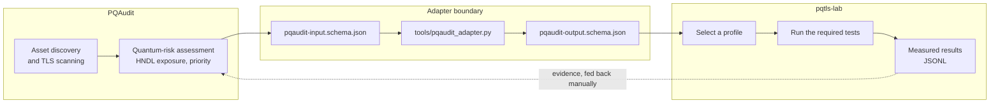

# PQAudit integration

PQAudit is a post-quantum readiness assessment platform. pqtls-lab measures what
post-quantum TLS actually costs. The two are complementary: one identifies assets
at risk, the other tells you what migrating them would involve.

**They are deliberately not coupled.** The boundary is a documented JSON adapter
format, not a shared library or an API dependency. Either project can change
independently, and neither needs the other to be useful.

## Scope, stated plainly

The adapter maps an asset's **currently observed** TLS configuration onto a
pqtls-lab profile to **test it against**, plus the tests that ought to be run
before anything changes.

It is a starting point for an experiment plan. It is **not**:

- a migration tool;
- an assertion that the recommended profile will work with the asset's existing
  clients;
- an assertion that migrating will preserve availability;
- any claim about post-quantum *authentication*, which stays classical in every
  non-experimental recommendation.

A recommendation always carries a non-empty `caveats` list, and CI asserts that
it does.

## Data flow



The dotted line is deliberate. Results flow back as **evidence for a human**, not
as an automated decision.

## Input format

Defined by [`schemas/pqaudit-input.schema.json`](../schemas/pqaudit-input.schema.json).

```json
{
  "schema_version": 1,
  "source": "pqaudit",
  "asset_id": "server-001",
  "tls": {
    "minimum_version": "TLS1.2",
    "key_exchange": "ECDHE-P256",
    "certificate_algorithm": "RSA-2048"
  },
  "quantum_risk": {
    "hndl_level": "high",
    "migration_priority": "critical",
    "data_sensitivity_years": 15
  }
}
```

`tls.key_exchange` and `tls.certificate_algorithm` are separate fields for the
same reason they are separate everywhere else in this project: key establishment
and authentication are different properties with different threat models.

`quantum_risk.hndl_level` describes *harvest-now-decrypt-later* exposure — how
damaging it would be if today's traffic were decrypted years from now. It is
driven mainly by `data_sensitivity_years`.

## Output format

Defined by [`schemas/pqaudit-output.schema.json`](../schemas/pqaudit-output.schema.json).

```json
{
  "schema_version": 1,
  "asset_id": "server-001",
  "recommended_profile": "hybrid-x25519-mlkem768",
  "authentication_transition": {
    "current": "RSA-2048",
    "recommended_initial": "ECDSA-P256",
    "recommended_experimental": "ML-DSA-65"
  },
  "classical_fallback_allowed": false,
  "required_tests": [
    "certificate-rollover",
    "certificate-validation",
    "concurrency",
    "downgrade-rejection",
    "latency",
    "legacy-client-compatibility",
    "mtu",
    "packet-loss",
    "tls12-client-inventory"
  ],
  "rationale": ["..."],
  "caveats": ["..."]
}
```

## Running it

```bash
python3 tools/pqaudit_adapter.py schemas/pqaudit-input.example.json

# or from a pipeline
cat asset.json | python3 tools/pqaudit_adapter.py --output recommendation.json
```

## How a profile is chosen

Match the classical half of the hybrid to the curve family the asset already
uses. Keeping the familiar component familiar reduces the number of things
changing at once, which matters a great deal when something later fails and has
to be attributed to a cause.

| Observed `key_exchange` | Recommended profile | Reasoning |
|---|---|---|
| Contains `P-384` or `secp384` | `hybrid-p384-mlkem1024` | Keeps the classical component at the security level already in use |
| Contains `P-256` or `secp256` | `hybrid-p256-mlkem768` | The smallest change from the current configuration |
| Anything else, or unspecified | `hybrid-x25519-mlkem768` | The primary default hybrid |

## How the fallback policy is chosen

| `hndl_level` | `classical_fallback_allowed` | Reasoning |
|---|---|---|
| `high` or `critical` | **`false`** | A connection that falls back is exactly the one an attacker would record. Permitting fallback here defeats the purpose |
| `low` or `medium` | `true` | Tolerable during migration; revisit once client coverage is known |

When fallback is disallowed, clients without the hybrid group **fail to connect**
rather than downgrading. That is the correct behaviour and it is also an
availability change, so the recommendation says so explicitly and adds
`legacy-client-compatibility` and `downgrade-rejection` to the required tests.

## Authentication stays classical

`recommended_initial` is **always** a classical signature scheme. This is not
conservatism about cryptography; it is the state of the certificate ecosystem:

- No public CA issues ML-DSA certificates for general use.
- ML-DSA certificates are roughly an order of magnitude larger than ECDSA P-256
  ones, compounding the larger key share.
- Intermediates, OCSP and Certificate Transparency all grow with them.

`recommended_experimental` names ML-DSA-65 as a **measurement target**, not a
deployment option, and the caveats say so.

An asset currently using RSA gets `certificate-rollover` added to its required
tests, because moving to ECDSA reduces handshake size and partly offsets the
larger key share — a change worth making alongside the migration rather than
after it.

## Required tests

Every recommendation carries these four:

| Test | Why |
|---|---|
| `certificate-validation` | Chain, hostname and trust anchor must still work after any certificate change |
| `mtu` | The post-quantum key share enlarges the ClientHello. This is the most likely place to break |
| `packet-loss` | More segments means more chances to lose one |
| `legacy-client-compatibility` | Which existing clients would stop connecting |

Plus, conditionally:

| Test | Added when |
|---|---|
| `downgrade-rejection` | Fallback is disallowed |
| `certificate-rollover` | The asset currently uses RSA |
| `tls12-client-inventory` | The asset currently permits TLS 1.2 |
| `concurrency`, `latency` | Migration priority is high or critical |

## Validating

```bash
python3 - <<'PY'
import json, jsonschema, pathlib
schema = json.loads(pathlib.Path("schemas/pqaudit-output.schema.json").read_text())
document = json.loads(pathlib.Path("recommendation.json").read_text())
jsonschema.validate(document, schema)
print("valid")
PY
```

CI validates the adapter's output against its schema and asserts that the
caveats list is non-empty.

## What this integration will not do

- **Automatic migration.** A recommendation is an experiment plan for a human to
  execute and review.
- **Guarantee compatibility.** That is what `legacy-client-compatibility` exists
  to find out.
- **Certify anything.** Neither project issues assurances about a deployed
  system.
- **Assume a profile is available.** A recommended profile still has to be
  confirmed with `pqtls-client capabilities` on the target host.

## Future work

Deliberately out of scope for the first release:

- Feeding measured pqtls-lab results back into PQAudit automatically.
- Fleet-wide recommendations across many assets at once.
- Cost modelling that accounts for certificate management and operations.
- A shared vocabulary for risk levels between the projects.

None of this should be built before there are measured results to feed it.
