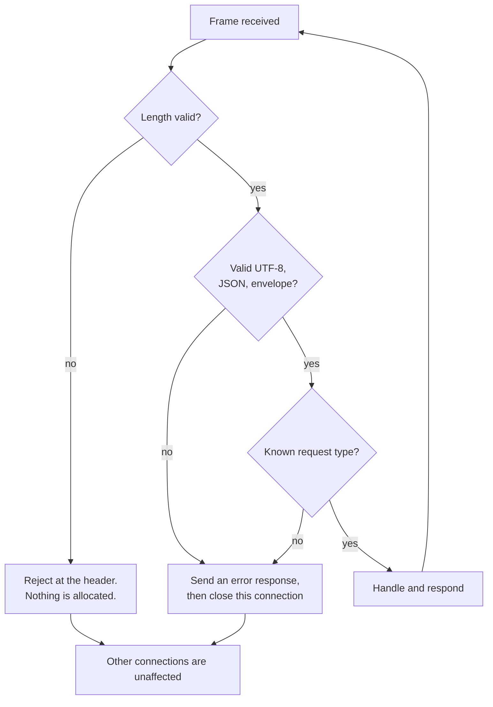

# Application protocol

A deliberately small framed JSON protocol carried over TLS 1.3. Its purpose is
to give the measurement harness something realistic to exchange, and to exercise
input validation — not to be a general-purpose messaging protocol.

ALPN identifier: **`pqtls1`**.

## Framing

TLS is a byte stream, not a message stream. A single `SSL_read` may return part
of a message, a whole message, or several messages. The length prefix is what
makes the boundary explicit.

```
 0                   1                   2                   3
 0 1 2 3 4 5 6 7 8 9 0 1 2 3 4 5 6 7 8 9 0 1 2 3 4 5 6 7 8 9 0 1
+-+-+-+-+-+-+-+-+-+-+-+-+-+-+-+-+-+-+-+-+-+-+-+-+-+-+-+-+-+-+-+-+
|                    payload length (uint32, big-endian)        |
+-+-+-+-+-+-+-+-+-+-+-+-+-+-+-+-+-+-+-+-+-+-+-+-+-+-+-+-+-+-+-+-+
|                                                               |
|                  payload: N bytes of UTF-8 JSON               |
|                                                               |
+-+-+-+-+-+-+-+-+-+-+-+-+-+-+-+-+-+-+-+-+-+-+-+-+-+-+-+-+-+-+-+-+
```

| | |
|---|---|
| Header | 4 bytes, unsigned, network byte order |
| Length | Counts the **payload only**, excluding the header |
| Minimum | 1 byte. A zero-length frame is always invalid |
| Default maximum | 1 MiB (1 048 576 bytes), configurable |
| Absolute ceiling | 64 MiB. Even an operator-supplied maximum cannot exceed it |
| Encoding | UTF-8. Validated independently of the JSON parser |

### Why the ceiling exists

`max_frame_size` is configurable, but bounded by a compile-time constant. A typo
in a config file — `104857600` instead of `1048576` — must not turn into a
memory-exhaustion primitive.

### Rejection happens at the header

The length is validated the moment the 4-byte header is complete, **before** any
buffer is reserved for the body. An attacker who can write four bytes must not be
able to make the peer allocate gigabytes.

```
feed(bytes):
    append to buffer
    if at least 4 unconsumed bytes available:
        length = decode_length(header)     # throws on 0 or > max
```

### Reassembly

`framing::Decoder` accepts arbitrary chunk boundaries:

```cpp
framing::Decoder decoder(max_frame_size);
decoder.feed(bytes_from_ssl_read);
while (auto frame = decoder.next_frame()) {
    handle(Message::parse(*frame));
}
```

It reclaims consumed buffer space, so a long-lived connection does not
accumulate the frames it has already handed out.

## Message envelope

Every message is a JSON **object** with these fields:

| Field | Type | Required | Notes |
|---|---|---|---|
| `protocol_version` | integer | **yes** | Must be `1` |
| `type` | string | **yes** | See the table below |
| `message_id` | string | no | UUIDv4. Generated when absent. Max 128 characters |
| `timestamp` | string | no | ISO-8601 UTC. Generated when absent |
| `status` | string | responses | e.g. `accepted`, `rejected` |
| `payload` | object | type-dependent | Must be an object when present |

## Message types

| Type | Direction | Response | Purpose |
|---|---|---|---|
| `ping` | client → server | `pong` | Minimal round trip; the benchmark default |
| `echo` | client → server | `acknowledgement` with the payload returned | Payload-size experiments |
| `telemetry` | client → server | `acknowledgement` | A realistic IoT-shaped message |
| `capabilities` | client → server | `acknowledgement` with negotiated parameters | Ask what the connection actually negotiated |
| `close` | client → server | *(none)* | Request an orderly close |
| `acknowledgement` | server → client | — | Generic success response |
| `pong` | server → client | — | Response to `ping` |
| `error` | server → client | — | A protocol violation, with a reason |

A client sending a **response** type (`acknowledgement`, `pong`, `error`) is
rejected. It is either confused or probing, and guessing an intent is worse than
refusing.

## Examples

### Client request

```json
{
  "protocol_version": 1,
  "message_id": "3f2a1b4c-5d6e-4f70-8901-a2b3c4d5e6f7",
  "type": "telemetry",
  "timestamp": "2026-08-05T10:00:00.000Z",
  "payload": {
    "device_id": "sensor-001",
    "temperature": 24.6,
    "status": "normal"
  }
}
```

### Server response

```json
{
  "protocol_version": 1,
  "message_id": "3f2a1b4c-5d6e-4f70-8901-a2b3c4d5e6f7",
  "type": "acknowledgement",
  "status": "accepted",
  "timestamp": "2026-08-05T10:00:00.042Z"
}
```

The `message_id` is echoed so a client can correlate replies when several
messages are in flight on one connection.

### Capabilities response

```json
{
  "protocol_version": 1,
  "message_id": "...",
  "type": "acknowledgement",
  "status": "accepted",
  "timestamp": "2026-08-05T10:00:00.042Z",
  "payload": {
    "server_profile": "hybrid-x25519-mlkem768",
    "tls_version": "TLSv1.3",
    "negotiated_group": "X25519MLKEM768",
    "cipher_suite": "TLS_AES_256_GCM_SHA384",
    "pq_key_establishment": true,
    "hybrid_key_establishment": true,
    "authentication": "ecdsa-p256",
    "pq_authentication": false
  }
}
```

Note that `pq_key_establishment` and `pq_authentication` are separate fields.
They describe different properties and are never merged.

### Error response

```json
{
  "protocol_version": 1,
  "message_id": "...",
  "type": "error",
  "status": "rejected",
  "timestamp": "2026-08-05T10:00:00.042Z",
  "payload": {
    "reason": "unknown message type 'exec_shell'"
  }
}
```

The reason describes the protocol violation and nothing else. It never exposes
internal state, file paths or key material.

## Validation

Every received frame passes all of these before it is interpreted. A violation
raises a `protocol` error.

| Check | Rejects |
|---|---|
| Frame length | Zero, or greater than `max_frame_size` |
| UTF-8 | Malformed sequences, **overlong encodings**, surrogates, code points above U+10FFFF |
| JSON | Anything not strictly valid |
| Document type | Anything that is not an object |
| Nesting depth | More than 16 levels |
| `protocol_version` | Missing, non-integer, or not `1` |
| `type` | Missing, non-string, or unknown |
| `message_id` | Non-string, or longer than 128 characters |
| `payload` | Present but not an object |
| Telemetry | Missing or non-string `payload.device_id` |
| Direction | A response type sent by a client |

### Why UTF-8 is validated separately

Overlong encodings give the same character more than one byte representation,
which is a long-standing way to slip a value past a filter that only checks one
form. The JSON library's behaviour on invalid UTF-8 is configurable, so this
project applies an independent, non-negotiable gate before parsing.

### Why nesting depth is capped

A deeply nested document is a cheap way to burn CPU or overflow a recursive
consumer. The parser used here is iterative, but downstream consumers — including
serialisation — may not be, so the limit is enforced before interpretation.

## Error handling



A protocol violation closes **that** connection, after a structured error where
one can still be sent. It never affects another connection, and it never takes
the server down. Continuing to serve a peer that has already sent something
invalid would let it feed garbage indefinitely.

## Limits

| | Default | Configurable | Ceiling |
|---|---|---|---|
| Frame payload | 1 MiB | `--max-frame-size` | 64 MiB |
| JSON nesting depth | 16 | no | — |
| `message_id` length | 128 | no | — |
| Messages per connection | 1024 | `--max-messages` | — |
| I/O timeout | 30 s | `--io-timeout` | — |
| Handshake timeout | 10 s | `--handshake-timeout` | — |

## Version negotiation

There is currently **one** protocol version, and there is deliberately no
negotiation mechanism yet.

`protocol_version` is validated strictly: a message declaring version 2 is
rejected outright rather than being interpreted optimistically. Adding
negotiation before there is a second version to negotiate would mean shipping an
untestable mechanism.

## Compatibility policy

| Change | Version impact |
|---|---|
| Adding an optional envelope field | None; ignore it if unknown |
| Adding a message type | None for peers that never send it |
| Adding a required field | **Breaking.** New protocol version |
| Changing the framing | **Breaking.** New protocol version |
| Changing a field's meaning | **Breaking.** New protocol version |
| Tightening validation | Treated as breaking if it rejects previously accepted messages |

The metrics schema is versioned independently (`schema_version`), because a
result file outlives the connection that produced it.

## Implementation

| | |
|---|---|
| Framing and validation | `src/common/application_protocol.cpp` |
| Declarations | `include/pqtls/application_protocol.hpp` |
| Server message handling | `src/server/server.cpp` |
| Unit tests | `tests/unit/test_application_protocol.cpp` |
| Adversarial tests | `tests/integration/test_invalid_messages.py` |

The adversarial tests speak the wire protocol directly with a standard-library
TLS socket rather than through `pqtls-client`, because the point is to send
things our own client would refuse to construct.
