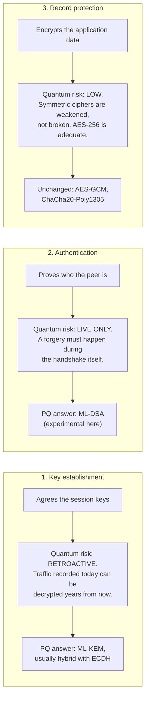
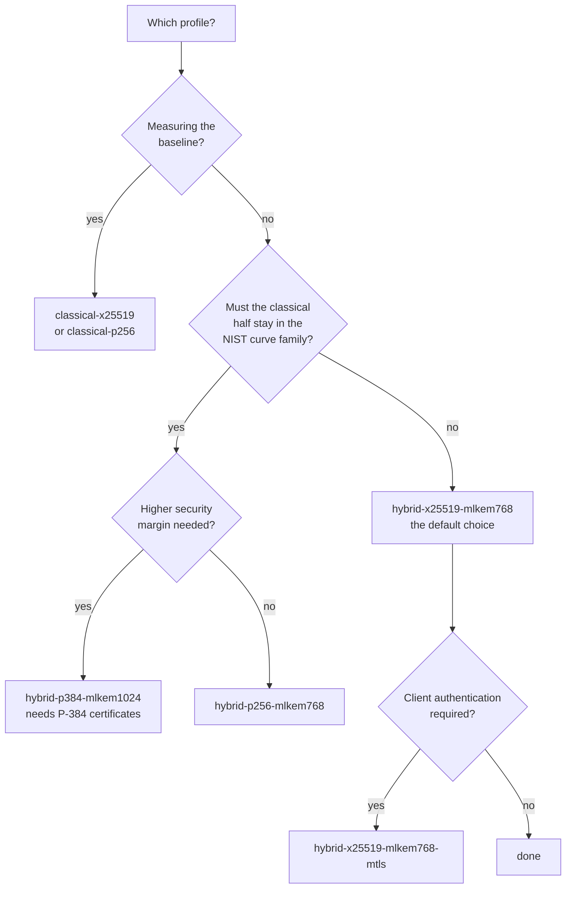

# Security profiles

A **security profile** is an immutable, validated TLS policy. It is the unit of
crypto-agility in this project: changing one flag changes what the connection
negotiates, and the change is visible, checkable and recorded.

## What a profile contains

| Field | Meaning |
|---|---|
| `id` | Stable identifier used on the command line and in metrics |
| `description` | Human-readable summary |
| `tls.minimum_version` / `tls.maximum_version` | Both pinned to TLS 1.3 |
| `groups` | **Key establishment.** Ordered; only these are offered |
| `cipher_suites` | **Record protection.** An explicit allowlist |
| `authentication.type` | **Identity.** The signature scheme expected |
| `authentication.require_client_certificate` | Mutual TLS |
| `fallback.allow_classical` | Whether a classical group may be accepted |
| `experimental` | Whether the profile is a research artefact rather than a candidate configuration |

The three cryptographic fields are deliberately separate and are never merged.
See [the distinction](#the-three-properties) below.

## The catalogue

| Profile | Group | Auth | Fallback | Experimental |
|---|---|---|---|---|
| `classical-x25519` | `X25519` | ECDSA P-256 | allowed | no |
| `classical-p256` | `secp256r1` | ECDSA P-256 | allowed | no |
| `hybrid-x25519-mlkem768` | `X25519MLKEM768` | ECDSA P-256 | **forbidden** | no |
| `hybrid-p256-mlkem768` | `SecP256r1MLKEM768` | ECDSA P-256 | **forbidden** | no |
| `hybrid-p384-mlkem1024` | `SecP384r1MLKEM1024` | ECDSA P-384 | **forbidden** | no |
| `hybrid-x25519-mlkem768-mtls` | `X25519MLKEM768` | ECDSA P-256, mutual | **forbidden** | no |
| `pure-mlkem768` | `MLKEM768` | ECDSA P-256 | **forbidden** | **yes** |
| `hybrid-pq-auth` | `X25519MLKEM768` | **ML-DSA-65** | **forbidden** | **yes** |

The built-in catalogue lives in `src/common/security_profile.cpp`;
`config/profiles.yaml` mirrors it and can extend or override it.

### Why the classical profiles allow fallback

They have nothing to fall back *from*. `classical-x25519` offers only X25519, so
`allow_classical: true` simply states the obvious. The flag exists to make the
hybrid profiles' `false` meaningful.

### Why `hybrid-p384-mlkem1024` restricts its cipher suites

It permits only `TLS_AES_256_GCM_SHA384`. Pairing a 128-bit AEAD with an
ML-KEM-1024 key exchange would make the record layer the weakest component of a
profile whose entire purpose is a higher security margin.

It also needs **ECDSA P-384 certificates**:

```bash
scripts/generate-classical-certs.sh --curve secp384r1 --output-dir certs/p384
```

## The three properties

A TLS connection has three separable cryptographic properties. Conflating them
is the most common way a project ends up overstating what it provides.



**Why key establishment is migrated first.** It is the only one of the three
that is attackable retroactively. A signature forged in 2035 cannot retroactively
impersonate a server in a 2026 handshake — that handshake is over. A key
exchange recorded in 2026 *can* be broken in 2035, and everything it protected
read then. Authentication migration is a real requirement, but it is not the
urgent one, and it is blocked on a certificate ecosystem that does not yet exist.

Consequently, for `hybrid-x25519-mlkem768`:

> The session keys resist a future quantum adversary.
> The server's identity does not.
> The connection is **not** end-to-end quantum-safe.

Each metrics record therefore carries three separate booleans:

| Field | True when |
|---|---|
| `pq_key_establishment` | The **negotiated** group provides PQ key establishment |
| `hybrid_key_establishment` | That group combines a classical share with an ML-KEM share |
| `pq_authentication` | The peer authenticated with a post-quantum signature |

All three are derived from what was *observed*, never from what was *requested*.

## Validation

`SecurityProfile::create` rejects a definition that is not internally
consistent. There is no way to construct a partially-validated profile, so any
profile a `TlsContext` receives has already passed these checks.

| Rejected | Why |
|---|---|
| No `id` | Nothing to select or record it by |
| Empty `groups` | OpenSSL would fall back to its own defaults, defeating the profile |
| Duplicate group names | Makes the negotiated-group check ambiguous; almost always a copy-paste error |
| A `TLS_*` name in `groups` | That is a cipher suite. Different thing |
| A group name in `cipher_suites` | The reverse mistake |
| Any TLS version other than 1.3 | This project negotiates TLS 1.3 only |
| PQ **and** classical groups with `allow_classical: false` | Contradictory: it would advertise a group we would then refuse after the handshake |
| A pure ML-KEM group not marked experimental | Standalone ML-KEM is not covered by a finalised TLS specification |
| ML-DSA authentication not marked experimental | PQ authentication is a capability-gated experiment here |

Unknown keys in a profile definition are a **hard error**, not a warning. A typo
in a security policy must not leave a different policy quietly in effect.

## Downgrade rejection

Two independent layers.

**Layer 1 — negotiation.** Only the profile's groups are configured, via
`SSL_CTX_set1_groups_list`. A peer cannot steer us elsewhere because nothing else
is on offer. If a name is unknown to the local OpenSSL the call fails and we
abort, rather than proceeding with OpenSSL's defaults.

**Layer 2 — post-handshake verification.** After every handshake, on **both**
peers, the negotiated group is read back and checked against the profile:

```
permits_negotiated_group(g):
    g is empty                                    -> REJECT  (fail closed)
    g is not in the profile's group list          -> REJECT
    g is classical, fallback forbidden,
      and the profile offers a PQ group           -> REJECT
    otherwise                                     -> ACCEPT
```

A violation throws rather than logs. The connection is terminated **before any
application data is sent**, and the failure is recorded with
`error_category: "tls-policy"` — distinct from `handshake`, so a policy
rejection is never confused with a broken connection.

Both peers check. Relying on the client alone would leave a server quietly
serving classical connections under a hybrid profile.

### Case sensitivity

OpenSSL's canonical group names are not consistently capitalised:
`openssl list -tls-groups` reports `x25519` and `secp256r1` in lower case but
`X25519MLKEM768` in mixed case, and `SSL_get0_group_name` returns the canonical
spelling rather than the one that was requested. All group comparison in this
project is therefore ASCII case-insensitive. A case-sensitive comparison would
reject compliant connections, or worse, fail to recognise a group it should have
matched.

## Choosing a profile



For research into the cost of the classical half of a hybrid, or into
post-quantum authentication, use the experimental profiles — and label the
results as experimental.

## Adding a profile

1. Add it to `config/profiles.yaml`, or to the built-in catalogue in
   `src/common/security_profile.cpp`.
2. Add a case to `tests/unit/test_security_profiles.cpp`, including its
   downgrade behaviour.
3. Confirm it on a real host: `pqtls-client capabilities`.
4. Add it to the table in this document and in the README.
5. If it is experimental, say so — in the definition, in the docs, and in any
   result that uses it.

Never add a profile that mixes post-quantum and classical groups while
forbidding fallback: validation rejects it, and correctly so.
