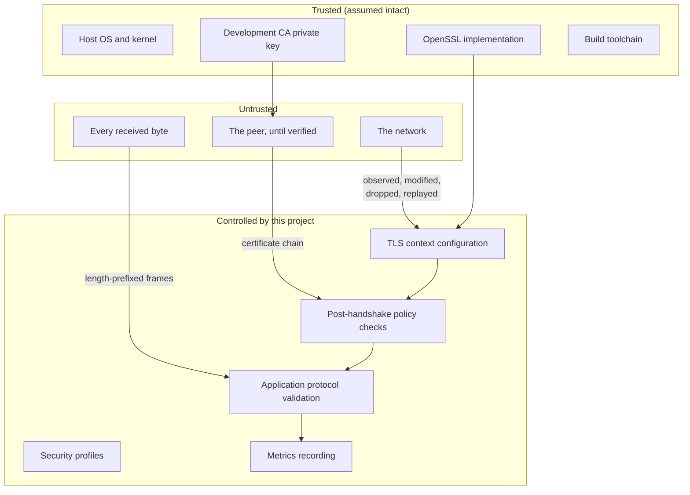

# Threat model

What pqtls-lab defends against, what it partially addresses, and what is out of
scope. Read this before drawing any security conclusion from the project.

**pqtls-lab is a research prototype and has not been independently audited.**
Nothing below should be read as an assurance about a deployed system.

## System and trust boundaries

The trust boundary is the point where data crosses from the network into our
process. **Everything arriving from the network is untrusted until it has been
verified**, including the peer's certificate, the negotiated parameters and every
byte of every frame.

---

## Protected against

### Passive network interception

TLS 1.3 with an AEAD cipher suite from an explicit allowlist. TLS 1.2 and earlier
are disabled at both the version bounds and the option flags; compression and
renegotiation are off.

**Assumes:** the OpenSSL implementation is correct, and the endpoints are not
compromised.

### Harvest-now-decrypt-later, when a hybrid group is negotiated

This is the project's central purpose. An adversary recording traffic today
cannot decrypt it later from a quantum computer alone, because the session keys
depend on an ML-KEM encapsulation as well as an ECDH exchange.

**Only when a hybrid group was actually negotiated.** A classical connection has
no such protection, which is why the negotiated group is verified after every
handshake and recorded in every metrics record.

**Assumes:** ML-KEM-768 is secure at its claimed level; the hybrid combiner is
correctly implemented in OpenSSL; the recorded traffic was not also obtained by
compromising an endpoint.

### Active man-in-the-middle, when certificate validation succeeds

The client verifies the full chain to a configured trust anchor, checks validity
dates, and verifies the hostname against `subjectAltName` via `SSL_set1_host`,
so a mismatch fails the handshake rather than being a check we must remember to
perform afterwards. Unknown CAs and absent certificates are refused.

**Important caveat:** this protection rests on a **classical ECDSA signature** in
every non-experimental profile. An adversary who can forge ECDSA signatures — a
quantum adversary, *at the time of the handshake* — can impersonate the server
despite the post-quantum key exchange. This is a live-attack capability, not a
retroactive one, which is why key establishment is migrated first.

### Accidental classical fallback

Two layers, described fully in
[`security-profiles.md`](security-profiles.md#downgrade-rejection): only the
profile's groups are offered, and the negotiated group is verified afterwards on
both peers. A violation terminates the connection before application data flows
and is recorded as `error_category: "tls-policy"`.

The `--insecure-development-mode` escape hatch does **not** disable this check;
it disables peer verification only.

### Malformed application messages

Rejected: oversized frames (refused on the header, before allocation),
zero-length frames, invalid UTF-8 including overlong encodings and surrogates,
malformed JSON, unknown protocol versions, missing mandatory fields, unknown
message types, excessive nesting, and response types sent by a client.

A protocol violation closes that connection and does not affect any other.

### Basic replay within application rules

Each message carries a UUIDv4 `message_id` and an ISO-8601 timestamp, and
responses echo the request id for correlation.

**This is weak.** The server does not currently maintain a seen-identifier
cache, so it will not itself reject a duplicated message. TLS's own record-layer
protections prevent replay *within* a connection; application-level replay
across connections is the application's responsibility. Do not rely on this
property.

### Uncontrolled resource growth

A bounded worker pool doubles as a bounded accept queue: connections beyond
`max_connections` are closed immediately rather than queued without limit.
Per-connection message counts, frame sizes, JSON nesting depth, handshake
timeouts and I/O timeouts are all capped.

---

## Partially protected, or experimental

### Post-quantum authentication

**Experimental and capability-gated.** `hybrid-pq-auth` uses ML-DSA-65 and is the
only profile in which both key establishment and authentication are
post-quantum.

Its limits are severe and are not defects of this project:

- The certificates chain to a private CA. **Nothing outside this project accepts
  them.** No public CA issues ML-DSA certificates for general use.
- Availability depends entirely on the OpenSSL build.
- ML-DSA certificates are roughly an order of magnitude larger than ECDSA P-256
  ones, which enlarges the handshake and interacts with the same MTU and loss
  problems as the larger key share.
- Real-world certificate chains involve intermediates, OCSP and CT, none of
  which this project models.

Use it to measure overhead (RQ5). Do not treat it as a deployment path.

### Denial of service

Partially addressed. The bounded pool, the timeouts and the size limits prevent
the most obvious resource exhaustion, and a failed handshake does not affect
other connections.

Not addressed: distributed floods, TLS-level computational amplification (a
post-quantum handshake costs the server more than the classical one, which
changes the economics of a handshake flood), amplification via connection churn,
and slow-loris variants beyond what the timeouts catch. There is no rate
limiting, no connection quota per source and no proof-of-work.

**A denial-of-service evaluation of post-quantum handshake cost is future work,
not a property this project currently provides.**

### A compromised certificate authority

Out of the project's control. A CA that signs a certificate for an attacker
defeats authentication entirely, and no amount of post-quantum key establishment
helps: the attacker becomes a legitimate endpoint.

Not implemented: certificate pinning, Certificate Transparency verification,
CAA checking, revocation (CRL or OCSP). The development CA is a single
self-signed key sitting unencrypted next to the certificates it signs, which is
appropriate for a test PKI and for nothing else.

### A compromised endpoint

Out of the project's control by construction. An attacker with code execution on
either peer has the session keys, the private key, and the plaintext.

Partial hardening only: RAII ownership of all OpenSSL objects, no raw owning
pointers, bounds-checked buffers, stack protector and FORTIFY_SOURCE where the
toolchain supports them, RELRO, immediate binding and a non-executable stack on
Linux, and a non-root container user. These raise the cost of exploiting a
memory-safety bug; they do not eliminate the class.

### Side-channel attacks

**Not addressed, and partly in tension with the project's purpose.**

pqtls-lab is a *measurement* tool. It records handshake durations, CPU time and
byte counts with deliberate precision, and it writes them to a file. That is
exactly the information a timing-side-channel adversary wants.

- Constant-time behaviour is inherited from OpenSSL and is not verified here.
- The metrics themselves are a side channel if published carelessly. Results
  from a test PKI are harmless; the same instrumentation pointed at a real
  service would not be.
- No countermeasures against cache-timing, power analysis or electromagnetic
  emissions.

Treat the timing data as sensitive whenever the keys are.

### Implementation flaws in external libraries

All cryptography comes from OpenSSL; nothing here implements a primitive. That
is the right choice, and it means an OpenSSL vulnerability is inherited in full.

Mitigations: an exact pinned version with a verified checksum, so the version in
use is always known; a documented dependency list; Dependabot proposing updates
for review rather than applying them; and CodeQL, clang-tidy and cppcheck over
our own code. ML-KEM support in OpenSSL is comparatively new and has had far less
scrutiny than the classical code paths — which is itself an argument for hybrid
over pure post-quantum groups.

---

## Out of scope

These are stated so that no one mistakes silence for coverage.

### Host operating-system compromise
A compromised kernel or a malicious root user can read process memory, session
keys and private keys directly.

### Hardware implants and firmware compromise
Nothing at the application layer helps against a compromised CPU, network
controller or platform firmware.

### A malicious compiler or toolchain
Reproducible builds are not implemented. The pinned dependencies and recorded
build metadata make a build *identifiable*, not *verified*.

### Physical device capture
Private keys are stored unencrypted on disk. There is no HSM support, no TPM
integration and no key encryption at rest. On a Raspberry Pi deployed at an
edge site, physical access is physical compromise.

### Global traffic analysis
An adversary observing traffic globally can correlate timing and volume
regardless of encryption. TLS 1.3 does not hide message sizes or timing, and
this project adds no padding or cover traffic. A post-quantum handshake is in
fact *more* distinguishable than a classical one, because it is larger.

### Quantum attacks on the classical half of a hybrid
By design, a hybrid group is secure if *either* component is secure. The
classical component alone is not expected to resist a quantum adversary; that is
what the ML-KEM component is for.

---

## Assumptions

Everything above depends on all of these holding:

1. OpenSSL correctly implements TLS 1.3, ML-KEM and the hybrid combiner.
2. The host OS, kernel and hardware are not compromised.
3. The CA private key is not compromised.
4. Certificates are generated with adequate randomness (`RAND_bytes` /
   `genpkey`, both from OpenSSL's CSPRNG).
5. The system clock is roughly correct — certificate validity depends on it.
6. Development-only options are never enabled outside development. `PQTLS_ENV=production` enforces this, but only where it is actually set.
7. Private keys are not committed. `.gitignore` and a CI check enforce this, but
   neither can recover a key that has already been pushed.
8. ML-KEM-768 provides its claimed security level.

## Reporting a vulnerability

See [`SECURITY.md`](../SECURITY.md). Do not open a public issue.

## Review status

| | |
|---|---|
| Independent security audit | **None.** |
| Formal verification | None. |
| Cryptographic review | None beyond relying on OpenSSL's primitives. |
| Static analysis | CodeQL, clang-tidy, cppcheck in CI. |
| Dynamic analysis | ASan, UBSan and TSan builds in CI. |
| Fuzzing | **Not implemented.** The frame decoder and the JSON message parser are the obvious targets and are future work. |
| Last reviewed | 2026-08-05 |
